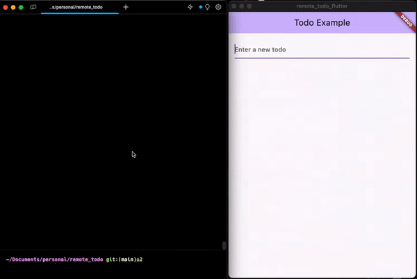

# Full stack todo app example

This application is a full-stack todo app example. It uses dart_frog as a backend and flutter as a frontend. It uses melos for managing the monorepo.



## Folder structure

* packages/backend_dart_frog - dart_frog backend
* packages/frontend_flutter - flutter frontend
* packages/todo - shared domain entity and business logic for todo application

## Pre-requisites

1. Install melos cli

   ```bash
    dart pub global activate melos
   ```

2. Install dart frog cli

   ```base
    dart pub global activate dart_frog_cli
   ```

3. Bootstrap the monorepo  
  This command initializes the workspace, links local packages together and installs the remaining package dependencies.

   ```bash
    melos bootstrap
    # or
    melos bs
   ```

## Running the app

1. Start the backend in dev mode

   ```bash
    melos run frogDev
   ```

2. Start the flutter app in `packages/frontend_flutter`  
   Using favorite editor or `flutter run` command.
